# Architecture Design: WebSocket Profiler for Dart VM

## 1. The Problem Space

The Dart and Flutter DevTools Network panel currently provides deep visibility into HTTP requests but lacks introspection for WebSocket traffic. As real-time, bidirectional data becomes standard in modern application architectures, this visibility gap severely limits developer debugging capabilities. Closing this gap is critical for debugging real-time chat, multiplayer gaming, and live-trading applications.

## 2. The Core Architecture

Global DevTools visibility requires deep, native instrumentation within the Dart SDK rather than relying on application-layer wrappers. The profiler is built on an opt-in, event-driven streaming architecture. It bridges `dart:io`, the Dart VM Service Protocol, and the Flutter DevTools frontend to process high-frequency WebSocket frames with minimal performance overhead on the Dart event loop.

### The Data Flow

```mermaid
flowchart LR
    A("Dart Application<br><span style='color:#5c2d91'>(dart:io WebSocket)</span>")
    B("<span style='color:#b8860b'>_WebSocketProtocolTransformer</span><br>Truncates payload > 10KB")
    C("Dart VM Service<br><span style='color:#5c2d91'>(http_profile / JSON-RPC)</span>")
    D("Flutter DevTools<br>(Network Panel)")

    A == "Raw TCP Frames" ==> B
    B == "postEvent()" ==> C
    C == "JSON-RPC" ==> D

    style A fill:#fff,stroke:#333,stroke-width:1px,color:#333
    style B fill:#fff,stroke:#333,stroke-width:1px,color:#333
    style C fill:#fff,stroke:#333,stroke-width:1px,color:#333
    style D fill:#fff,stroke:#333,stroke-width:1px,color:#333

    linkStyle 0 stroke:#333,stroke-width:2px,color:#333
    linkStyle 1 stroke:#333,stroke-width:2px,color:#228b22
    linkStyle 2 stroke:#333,stroke-width:2px,color:#333
```



1. Raw TCP Frames
2. Dart Application (`dart:io` WebSocket)
3. `WebSocketProtocolTransformer` (Measures and truncates payload > 10KB)
4. Dart VM Service (`http_profile`/JSON-RPC) via `postEvent()`
5. Flutter DevTools (Network Panel)

## 3. Implementation Details

### A. SDK-Level Interception & The Opt-In Toggle

- To ensure zero performance degradation, profiling remains strictly opt-in.
- The architecture hooks into the existing `HttpClient.enableTimelineLogging` flag (or introduces a unified `Network.enableTimelineLogging`) to activate interception logic deep within the internal `_WebSocketProtocolTransformer`.
- When activated via the VM Service, it instruments the internal transformer and outgoing `add` methods in `dart:_http`.

### B. Bidirectional Traffic Measurement

When timeline logging is active, the SDK intercepts the full-duplex transmission line:

- **Incoming (RX):** As the transformer decodes frames from the raw TCP socket, it extracts the payload size, timestamp, and frame type (Text/Binary) before yielding the frame to the application-level Stream.
- **Outgoing (TX):** Outgoing frames are intercepted and measured immediately before they are encoded and flushed to the underlying StreamSink.

### C. VM Service Protocol & Payload Truncation

- To transmit metrics to DevTools without blocking the Dart event loop, the intercepted data is serialized to JSON and dispatched via `postEvent()`.
- **The Truncation Strategy:** WebSockets are frequently used for high-frequency or heavy binary streaming. Deep-copying and serializing massive unbounded payloads (e.g., continuous video frames) over the VM Service would cause severe memory spikes.
- To protect the event loop, the SDK rigorously captures the true byte-size metadata, but intentionally truncates the actual payload body (e.g., capping at a 10KB limit) before broadcasting the event to the VM Service.
- This event integrates directly with the existing `http_profile` package to support connection-oriented protocols, defining generic types to transmit the timestamp, direction, frame type, and byte size metadata.

**Example JSON-RPC Payload Broadcast:**

```json
{
  "jsonrpc": "2.0",
  "method": "streamNotify",
  "params": {
    "streamId": "ext.dart.io.httpProfile",
    "event": {
      "type": "Event",
      "isolate": { "type": "@Isolate", "id": "isolates/123", "name": "main" },
      "connectionId": "ws_conn_01",
      "timestamp": "2026-03-18T14:25:57.810",
      "byteSize": 28,
      "direction": "outgoing",
      "payloadType": "text"
    }
  }
}
```

### D. DevTools UI Frontend Integration

- The Flutter DevTools Network Panel subscribes to this new VM Service event stream.
- Rather than relying on legacy polling, the frontend utilizes this event-driven stream to dynamically render bidirectional WebSocket frames alongside standard REST HTTP requests in real-time.
- A circular buffer is implemented on the frontend to prevent DevTools from running out of memory during extended debugging sessions.
