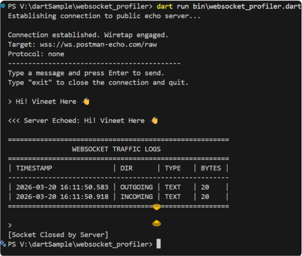

# WebSocket Profiler Sample
This is a prerequisite task for the GSoC 2026 Dart project.

## How to Run
1. Ensure you have the [Dart SDK](https://dart.dev/get-dart) installed.
2. Run `dart pub get` to fetch dependencies.
3. Run `dart run websocket_profiler.dart` to start the CLI

